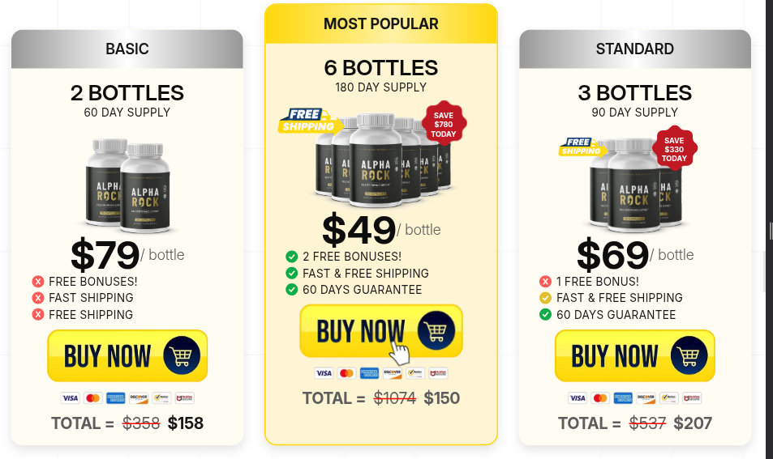
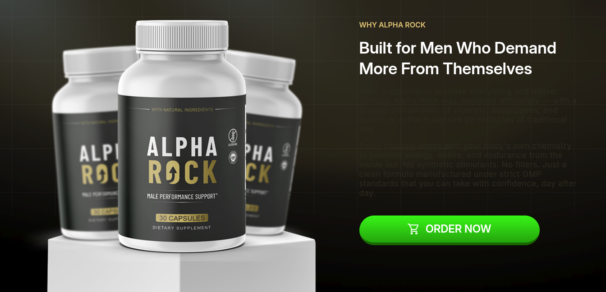
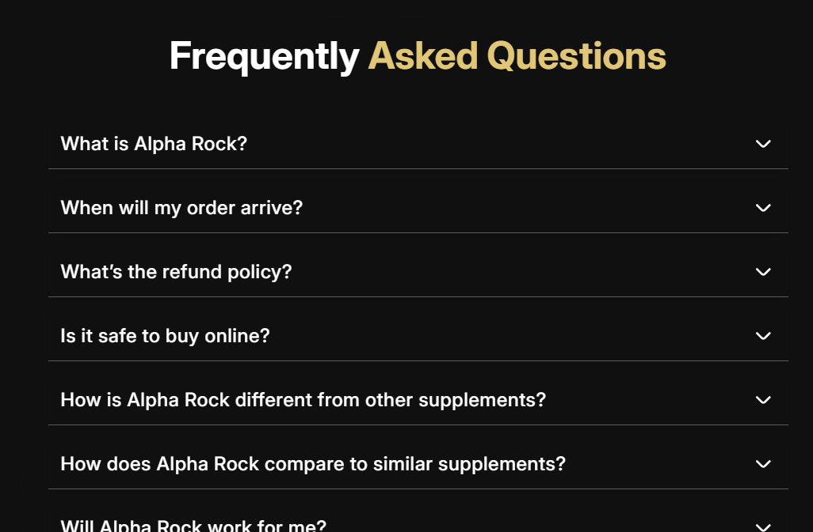
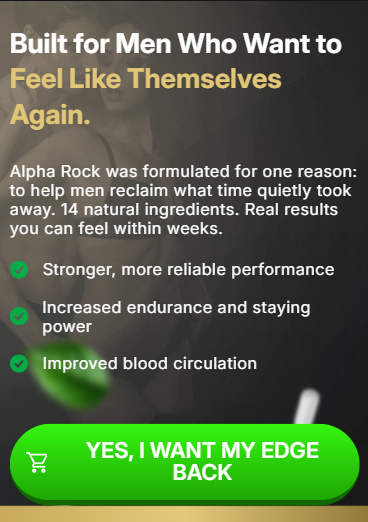
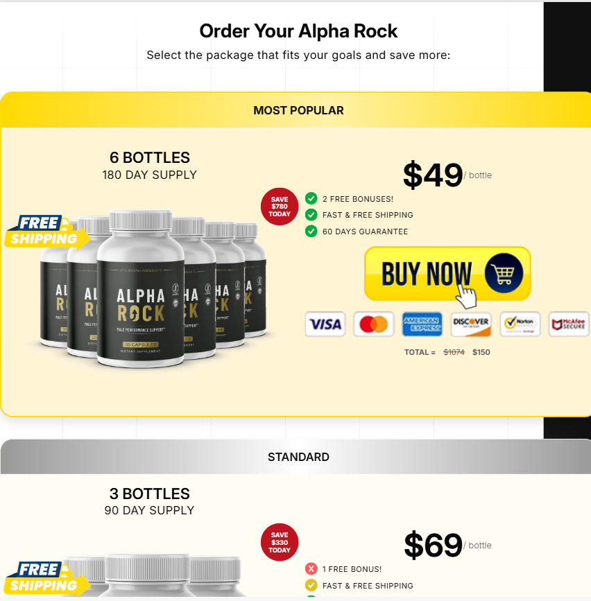
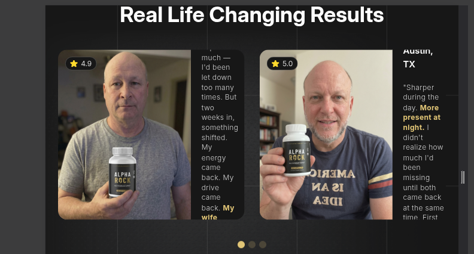
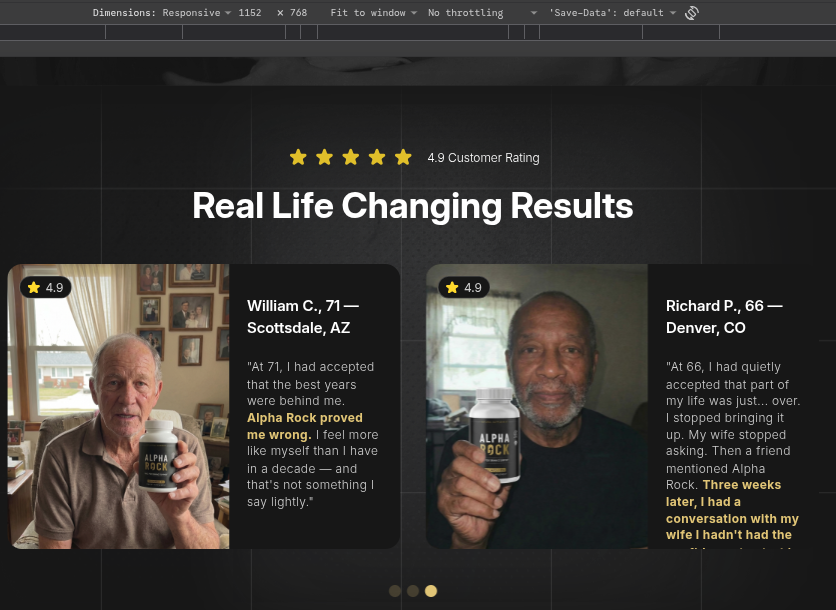
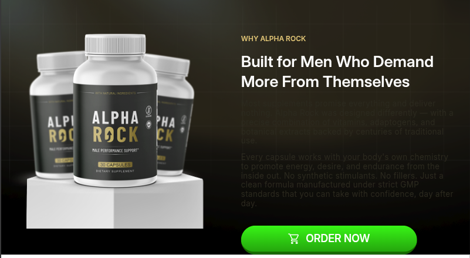
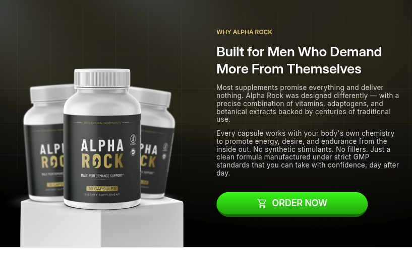

# DIAGNÓSTICO — Auditoria da página `biogutex.com`

**Desafio Técnico · Desenvolvedor Front-End Júnior 2 — XMX Corp**
**Etapa 1 — Diagnóstico**

---

## Contexto

[https://biogutex.com/](https://biogutex.com/) é uma landing page de venda de suplemento —
funil de conversão single-page, com hero, prova social, tabela de ofertas e FAQ. Foi entregue
por fornecedor externo e está no ar em produção. O cliente relatou "vários problemas" sem
detalhar quais.

O desafio indica **7 erros principais**. Encontrei **19 problemas**. Este documento apresenta
os 7 que considero principais, seguidos de 8 itens de bônus e 4 observações de produto.

---

## Metodologia

| Item                      | Como foi feito                                                                                         |
| ------------------------- | ------------------------------------------------------------------------------------------------------ |
| **Larguras testadas**     | 360px, 414px, 768px, 1024px, 1440px, 1920px — e **redimensionamento contínuo** de 320px a 1920px       |
| **Faixas intermediárias** | Varredura manual entre breakpoints — é onde a maioria dos erros desta página aparece                   |
| **Ferramentas**           | DevTools (Elements / Computed / Console / Network), emulação de dispositivo e teste em aparelho físico |
| **Testes de estado**      | Reload, scroll completo, interação com todos os elementos clicáveis                      |
| **Fonte**                 | Leitura do HTML servido e conferência da aritmética das ofertas                                        |

**Evidências:** as capturas estão em `img/`, relativas a este documento. Os seletores, causas e correções dos itens revisados seguem os trechos fornecidos pelo autor. B01 usa o PDF AUD-2026-005 como base. Esta revisão documental não executa nem confirma correções no site em produção.

> **Nota sobre a varredura contínua:** vários erros desta página **não aparecem** nas larguras
> padrão de teste. Eles só se manifestam em faixas intermediárias — 1260–900px, 1130–900px.
> Por isso o redimensionamento ao vivo foi parte central do método, e não um complemento.
> Testar só em 360/768/1440 encontraria menos da metade dos problemas de layout.

---

## Critério de seleção dos 7 principais

Como encontrei mais problemas que o esperado, precisei de um critério explícito para separar
"principal" de "bônus". Usei **impacto direto na conversão**, nesta ordem:

1. Impede ou desestimula a compra (erro de preço, CTA sem link, seção de oferta quebrada)
2. Bloqueia o acesso à informação que sustenta a compra (texto ilegível, FAQ que não abre)
3. Quebra a experiência em faixa de largura com tráfego real

Problemas graves mas de outra natureza — como o `.git` exposto — estão no **Bônus**, não por
serem menores, mas porque não são erros de front-end da página. O `.git` exposto é, isolado,
o problema mais sério que encontrei no projeto inteiro.

---

## Resumo

### 7 principais

| #   | Erro                                                 | Natureza            | Gravidade  |
| --- | ---------------------------------------------------- | ------------------- | ---------- |
| 01  | Total do card principal exibe $150 em vez de $294    | Funcional / Negócio | 🔴 Crítico |
| 02  | CTA do card principal: `.kit-option a` sem `href`  | Funcional           | 🔴 Crítico |
| 03  | Texto sem contraste na seção "Sobre"                 | Visual / A11y       | 🔴 Crítico |
| 04  | FAQ não abre                                         | Funcional           | 🔴 Crítico |
| 05  | Imagem do produto some no mobile (hero)              | Responsividade      | 🔴 Crítico |
| 06  | Seção "Order Your Alpha Rock" com overflow até 900px | Responsividade      | 🔴 Crítico |
| 07  | Link da página de contato aponta para `.hmtl` | Funcional | 🟡 Médio |

### Bônus — problemas adicionais

Os identificadores restantes foram preservados; o antigo B05 passou a ser o Erro 07.

| #   | Erro                                                 | Natureza         | Gravidade  |
| --- | ---------------------------------------------------- | ---------------- | ---------- |
| B01 | `.git` exposto e listagem de diretórios ativa | Segurança | 🔴 Alta / 🟡 Média |
| B02 | Cards de depoimento cortam o texto (900–1260px)      | Responsividade   | 🟡 Médio   |
| B03 | Imagem cortada e CTA colado na base (900–1130px)     | Responsividade   | 🟡 Médio   |
| B04 | Identidade do site incoerente (title / OG / domínio) | Meta / SEO       | 🟡 Médio   |
| B06 | HTML sem semântica                                   | Estrutura / A11y | 🟡 Médio   |
| B07 | Todas as imagens com o mesmo `alt`                   | A11y             | 🟡 Médio   |
| B08 | CSS duplicado inúmeras vezes                         | Manutenção       | 🟢 Baixo   |
| B09 | Comentário HTML órfão vazando como texto             | Visual           | 🟢 Baixo   |

### Observações de produto — visão de cliente

| #   | Observação                                                           |
| --- | -------------------------------------------------------------------- |
| C01 | Card de 2 garrafas não lista a garantia de 60 dias — tem ou não tem? |
| C02 | Ícone de check amarelo fora do padrão no card de 3 garrafas          |
| C03 | Open Graph configurado, mas a imagem quebra no WhatsApp              |
| C04 | Páginas do rodapé sem consistência de título, estilo e layout        |

---

# Erros principais

---

## Erro 01 — Total do card principal exibe $150 em vez de $294

### 1. O que está errado

O card **"6 BOTTLES · MOST POPULAR"** — a oferta que a própria página recomenda, com o aviso
_"97% Of Customers Order 6 Bottles"_ — exibe um total incorreto.

O card anuncia **$49 por garrafa** e **"Save $780 TODAY"**, mas o total exibido é
**~~$1074~~ $150**.

A consequência visível para o cliente é pior que o erro em si: **$150 pelas 6 garrafas é mais
barato que os $207 das 3 garrafas.** O pacote maior aparece custando menos que o menor. O
usuário atento conclui que a página está errada ou que o preço é pegadinha — e, no pior
cenário, compra esperando pagar $150 e é cobrado outro valor no checkout.

### 2. Onde está

- **Seção:** `#kits` — "Order Your Alpha Rock"
- **Elemento:** campo de total do card de 6 garrafas (`Total = $1074 $150`)
- **Escopo:** todas as larguras, todos os dispositivos

### 3. Por que acontece

Este é o caso raro em que **o valor correto está provado dentro do próprio card**. A aritmética
do site é totalmente consistente, exceto por este campo:

**Preço base do site — $179/garrafa:**

| Pacote     | Riscado exibido | Conferência       |
| ---------- | --------------- | ----------------- |
| 2 garrafas | $358            | 2 × 179 = 358 ✅  |
| 3 garrafas | $537            | 3 × 179 = 537 ✅  |
| 6 garrafas | $1074           | 6 × 179 = 1074 ✅ |

**Totais promocionais:**

| Pacote     | Preço/garrafa | Total esperado    | Total exibido |     |
| ---------- | ------------- | ----------------- | ------------- | --- |
| 2 garrafas | $79           | 2 × 79 = **$158** | $158          | ✅  |
| 3 garrafas | $69           | 3 × 69 = **$207** | $207          | ✅  |
| 6 garrafas | $49           | 6 × 49 = **$294** | **$150**      | ❌  |

**A confirmação definitiva vem do selo do próprio card:**

```
$1074 − $780 ("Save $780 TODAY") = $294
```

O desconto anunciado e o preço por garrafa **concordam entre si em $294**. Só o campo do total
diverge. Não é ambiguidade de qual valor está certo: dois dos três números do card apontam para
$294, e o terceiro está isolado.

**Causa raiz:** valor digitado errado no HTML. O `$150` não pertence a nenhuma das contas
desta página.

### 4. Como você corrigiria

Alterar o total no HTML do card de 6 garrafas: `$150` → `$294`.

**Ressalva importante:** o valor de checkout precisa ser conferido no gateway antes de
publicar. Se a página exibia $150 e o checkout cobra outro valor, existe um problema de
consumidor que vai além do front-end — e a correção do texto sozinha não resolve.

### 5. Gravidade: 🔴 **Crítico**

1. **Atinge a oferta principal.** É o card que a página empurra explicitamente como escolha de
   97% dos clientes. O erro está exatamente onde o dinheiro entra.
2. **Inverte a lógica de preço do funil.** A escada de valor deixa de fazer sentido: o pacote
   recomendado parece mais barato no total que o intermediário.
3. **Risco além da conversão.** Preço anunciado diferente do cobrado é atrito no checkout,
   chargeback e exposição em relação ao consumidor.

---

## Erro 02 — CTA do card principal: `<a>` sem `href` em `.kit-option`

### 1. O que está errado

O CTA de compra do card **"6 BOTTLES · MOST POPULAR"** não leva à oferta. O elemento `<a>` em `.kit-option` está sem `href`.

**Evidência — card principal e CTA de compra:**



A captura identifica o card afetado; a ausência de `href` é uma constatação do HTML, não algo demonstrável apenas pela imagem. O botão da captura exibe **"BUY NOW"**; "Add To Cart" é a referência usada para esse CTA no diagnóstico.

### 2. Onde está

- **Seção:** `#kits` — card de 6 garrafas.
- **Elemento:** `.kit-option a` do card principal, sem atributo `href`.
- **Escopo:** todas as larguras e dispositivos.

### 3. Por que acontece

O `<a>` já existe na estrutura de `.kit-option`, mas não tem destino definido. A falha está nesse elemento, não na imagem do botão. Sem `href`, ele não funciona como link de navegação para a oferta.

Os outros cards possuem destinos (`/linkoffer` e `/linkoffer3`), mas isso não comprova que funcionem: o PDF de auditoria registra retorno 404 para esses caminhos (p. 7, R2).

### 4. Como você corrigiria

Adicionar ao `<a>` existente em `.kit-option` o `href` com a URL correta da oferta de 6 garrafas. Manter a estrutura e a imagem do CTA. A URL final da oferta não foi fornecida e não deve ser inventada.

### 5. Gravidade: 🔴 **Crítico**

Impede a navegação para compra no pacote recomendado. Junto com o Erro 01, atinge o mesmo card: preço total incorreto e CTA sem destino.

---

## Erro 03 — Texto sem contraste na seção "Sobre"

### 1. O que está errado

O parágrafo descritivo da seção **"WHY ALPHA ROCK — Built for Men Who Demand More From
Themselves"** é renderizado em cor escura sobre o fundo escuro da seção. O texto fica
praticamente invisível: o usuário percebe que existe algo escrito ali — o bloco ocupa espaço,
o eyebrow e o título aparecem normalmente — mas não consegue ler sem selecionar com o mouse.

Ocorre em **todos os dispositivos e todas as larguras**. Não é condicional: é o estado padrão.

**Evidência — seção "Sobre" em 1344px:**



### 2. Onde está

- **Seção:** `.sobre` — bloco "WHY ALPHA ROCK"
- **Seletor:** `.sobre .container .content p`
- **Elementos afetados:** ambos os parágrafos do bloco de conteúdo

### 3. Por que acontece

A cor aplicada a `.sobre .container .content p` é escura sobre o fundo escuro da seção, tornando os parágrafos praticamente ilegíveis.

### 4. Como você corrigiria

Alterar apenas a cor para `#cfcfcf`, como no restante do site:

```css
.sobre .container .content p {
  color: #cfcfcf;
}
```

### 5. Gravidade: 🔴 **Crítico**

1. **Atinge 100% dos usuários**, em qualquer dispositivo, sem depender de interação.
2. **Atinge o argumento de venda.** É o bloco de copy que justifica o produto: composição,
   diferenciação, padrão GMP. Em funil, copy ilegível é receita que não entra.
3. **Falha objetiva de acessibilidade**, mensurável em critério WCAG — não questão de gosto.

---

## Erro 04 — FAQ não abre

### 1. O que está errado

As perguntas do bloco **"Frequently Asked Questions"** não respondem ao clique. O usuário
clica na pergunta — ou no ícone de seta, que sinaliza explicitamente que o item expande — e
nada acontece: o conteúdo não abre, não há transição, não há mudança de estado visual.

A interface **promete** a interação (seta de acordeão, divisores entre itens, pergunta em
destaque) e não a entrega. Isso é pior que um FAQ estático: o usuário tenta, falha e conclui que
a página está quebrada.

**Evidência — FAQ no estado em que permanece após os cliques:**



### 2. Onde está

- **Seção:** FAQ — "Frequently **Asked Questions**"
- **Código:** o trecho responsável pela abertura/fechamento dos itens está **comentado** no
  código-fonte
- **Escopo:** todas as perguntas do bloco, todas as larguras, todos os dispositivos

### 3. Por que acontece

**Causa raiz confirmada: a lógica do acordeão está comentada no código.**

A estrutura do componente está completa — as respostas **estão presentes no HTML servido**,
apenas ocultas por padrão, e o CSS já esconde o conteúdo e desenha a seta. O que falta é
exatamente a peça que faz a ponte entre o clique e o estado "aberto": o código que alterna esse
estado está desativado por comentário. O componente fica permanentemente no estado inicial.

Três características tornam esse erro especialmente fácil de passar despercebido:

1. **Não gera erro no console.** Código comentado não é executado, então não falha — ele
   simplesmente não existe para o navegador. Nenhum alerta, nenhuma exceção.
2. **A página parece correta.** O estado fechado é o estado visual esperado de um FAQ. Em
   screenshot, revisão visual ou teste de layout, o componente está perfeito.
3. **O código parece presente.** Quem abre o arquivo e bate o olho vê a lógica do acordeão lá.
   Só lendo com atenção se nota que ela está desativada.

**Hipótese de origem:** trecho comentado durante o desenvolvimento — para isolar outro bug ou
testar outra abordagem — e nunca reativado antes da publicação. É o padrão típico de "desliguei
para testar e esqueci", e sobrevive justamente porque, como descrito acima, nada denuncia sua
ausência.

### 4. Como você corrigiria

**Correção imediata:** remover o comentário e reativar o trecho. Em seguida, conferir que o
código reativado funciona — ele pode ter sido comentado justamente por estar quebrado. Validar:
console limpo, cada item abre e fecha, e o estado da seta acompanha.

**Correção estrutural — o que eu de fato entregaria:** trocar o acordeão por
`<details>`/`<summary>` nativo.

```html
<details class="faq__item">
  <summary class="faq__question">What is Alpha Rock?</summary>
  <div class="faq__answer">
    <p>Alpha Rock is a dietary supplement in capsule form…</p>
  </div>
</details>
```

```css
.faq__question {
  list-style: none; /* remove o marcador nativo */
  cursor: pointer;
}
.faq__question::-webkit-details-marker {
  display: none;
}

.faq__question::after {
  /* seta no lugar do marcador */
  content: '';
  transition: transform 0.2s ease;
}
.faq__item[open] .faq__question::after {
  transform: rotate(180deg);
}
```

O ganho é justamente contra o tipo de falha que aconteceu aqui: **o acordeão nativo funciona
sem nenhuma linha de JavaScript.** Não há código para comentar, esquecer ou quebrar. Além
disso, vem com semântica de estado expansível para leitores de tela, é navegável por teclado
por padrão e o conteúdo é indexável.

Se o design exigir comportamento extra — como fechar os outros itens ao abrir um — o JS entra
**por cima** do comportamento nativo, como melhoria progressiva. Se esse JS falhar, o FAQ
continua abrindo. Hoje, quando o JS falha, o FAQ inteiro deixa de funcionar.

**Correção de processo:** código comentado não deveria chegar à produção. Um linter com regra
contra blocos comentados, ou simplesmente revisão de diff antes do deploy, pega esse caso. Código
que não será usado se apaga — o histórico do Git guarda a versão anterior.

### 5. Gravidade: 🔴 **Crítico**

1. **Bloqueia conteúdo de decisão de compra.** O FAQ responde prazo de entrega, política de
   reembolso, segurança do pagamento e garantia — as objeções finais antes da compra.
2. **Atinge 100% dos usuários** — não é condicional.
3. **Enterra informação que a página promete.** A garantia de 60 dias e o suporte por SMS estão
   dentro das respostas que não abrem.
4. **A interface promete e não entrega.** A seta convida ao clique. Uma affordance que falha é
   sinal de página quebrada — na seção que o usuário visita exatamente quando ainda tem dúvida.

---

## Erro 05 — Imagem do produto desaparece no mobile

### 1. O que está errado

A imagem principal do produto desaparece no hero em telas pequenas.



### 2. Onde está

- **Seletor:** `main .container .area-img .main_product`.
- **Breakpoint:** `@media (max-width: 420px)`.

### 3. Por que acontece

A declaração `position: absolute !important` retira a imagem do fluxo. Sem a imagem contribuindo para o tamanho do contêiner, ele fica com tamanho zero e o produto desaparece. A causa deste erro é o colapso do contêiner provocado pelo posicionamento absoluto, não `overflow: hidden`.

### 4. Como você corrigiria

Remover a declaração `position: absolute !important` desse seletor no breakpoint de 420px. O trecho enviado mostra essa linha já comentada:

```css
@media (max-width: 420px) {
  main .container .area-img .main_product {
    /* position: absolute !important; */
  }
}
```

Se a regra ficar vazia, remover esse bloco. Preservar eventuais outras regras do mesmo `@media`. Não é necessário criar seletores ou reconstruir o hero.

### 5. Gravidade: 🔴 **Crítico**

O produto deixa de aparecer na primeira dobra em celulares, prejudicando sua apresentação logo na entrada da página.

---

## Erro 06 — Seção "Order Your Alpha Rock" com overflow até 900px

### 1. O que está errado

Os cards da seção de ofertas ultrapassam a largura disponível, causando transbordamento horizontal.



### 2. Onde está

- **Seção:** `.area-kits`.
- **Seletor:** `.area-kits .container`.
- **Breakpoint:** `@media (max-width: 900px)`.

### 3. Por que acontece

O contêiner recebe `width: 110%`, ficando maior que a largura disponível, junto de `max-width: 1000px`:

```css
@media (max-width: 900px) {
  .area-kits .container {
    width: 110%;
    max-width: 1000px;
  }
}
```

### 4. Como você corrigiria

Remover `width: 110%` da regra existente e alterar `max-width` para `800px`:

```css
@media (max-width: 900px) {
  .area-kits .container {
    max-width: 800px;
  }
}
```

A alteração deve ser feita na regra original: apenas adicionar outra regra sem remover `width: 110%` não elimina essa declaração.

**Ressalva visual:** eu também adicionaria um breakpoint em `560px`, com `display: flex` em `.area-kits .container ul .best-option a`. A estrutura fica melhor visualmente nessa faixa:

```css
@media (max-width: 560px) {
  .area-kits .container ul .best-option a {
    display: flex;
  }
}
```

### 5. Gravidade: 🔴 **Crítico**

O transbordamento afeta a seção de compra e dificulta visualizar os pacotes completos em telas menores.

---

## Erro 07 — Link da página de contato aponta para `.hmtl`

### 1. O que está errado

Na seção **"100% SATISFACTION GUARANTEED"**, o link de contato aponta para `contact.hmtl`, com a extensão digitada incorretamente. O acesso resulta em página não encontrada.


### 2. Onde está

Link **"link to our Contact Page"** no texto da garantia. O rodapé já usa `contact.html`.

### 3. Por que acontece

Erro de digitação no `href`: `.hmtl` em vez de `.html`.

### 4. Como você corrigiria

Trocar o destino do link para **`contact.html`**. Essa é a correção necessária.

### 5. Gravidade: 🟡 **Médio**

Prejudica o acesso ao contato justamente no bloco de garantia. Existe um caminho alternativo no rodapé, mas o link dessa seção precisa funcionar.

---

# Bônus — Problemas adicionais

---

## B01 — `.git` exposto e listagem de diretórios ativa

**Base:** PDF de auditoria **AUD-2026-005**, de **17/09/2026**, páginas 3, 5 e 7. Os achados abaixo reproduzem a evidência documentada nessa avaliação; não representam um novo teste do servidor.

### Exposição do `.git` — V01 · 🔴 Alta

**Evidências registradas no PDF:**

- `/.git/HEAD` retorna `ref: refs/heads/main`.
- `/.git/` retorna **"Index of /.git"**.
- `/.git/config` revela o remote de um repositório identificado como privado pela auditoria e uma referência `includeIf` a arquivo de credenciais de CI.
- `/.git/logs/HEAD` expõe commit do runner de CI e hostname interno.

**Impacto:** possibilidade de reconstrução do código e do histórico do repositório, além de exposição de informações do pipeline de deploy. O PDF esclarece que o repositório não foi reconstruído nem baixado. A referência a um arquivo de credenciais não comprova, por si só, a leitura do valor de um segredo.

**Correção conforme a auditoria:** bloquear o acesso a `.git` e a arquivos ocultos no edge/origem, retirar `.git` do webroot e publicar somente os artefatos necessários ao site. O PDF recomenda também a rotação das credenciais de CI expostas.

Exemplo indicado no PDF para bloquear `.git` no Apache:

```apache
RedirectMatch 404 /\.git
```

### Listagem de diretórios — V02 · 🟡 Média

**Evidências registradas no PDF:** páginas **"Index of …"** em `/assets/`, `/assets/js/`, `/assets/css/` e `/.git/`, atribuídas ao `mod_autoindex` do Apache na origem, atrás do Cloudflare.

**Impacto:** enumeração dos arquivos servidos, facilitando a descoberta de backups, fontes e assets não referenciados.

**Correção conforme a auditoria:** desativar a indexação automática no Apache:

```apache
Options -Indexes
```

Aplicar as duas correções em conjunto. Desativar a listagem não bloqueia o acesso direto aos arquivos do `.git`; é necessário bloquear esse diretório e excluí-lo do deploy.

**Classificação:** Alta para V01 e Média para V02, conforme o PDF. A exposição do repositório é o achado de segurança mais grave do documento.

---

## B02 — Cards de depoimento cortam o texto (900–1260px) 🟡 **Médio**

**O que está errado.** Na seção **"Real Life Changing Results"**, os textos dos depoimentos ficam cortados na faixa de 900–1260px. O breakpoint informado está correto; o ajuste deve ser no conteúdo dos cards.

**Onde está.** Seção `.testemonials`, especificamente `.testemonials .testemonial-card .content`.

**Evidências:**





A primeira captura mostra o corte, sem informar a largura exata. A segunda registra a viewport de 1152px, dentro da faixa afetada.

**Por que acontece.** O texto ocupa mais espaço vertical conforme o card estreita e não fica integralmente acessível na área de conteúdo disponível.

**Como eu corrigiria.** Na faixa afetada, adicionar rolagem vertical na área de conteúdo e alinhar o conteúdo ao início:

```css
.testemonials .testemonial-card .content {
  overflow-y: scroll;
  justify-content: start;
}
```

Aplicar essas declarações no breakpoint correspondente já existente, preservando a estrutura dos cards. A rolagem permite acessar o restante do texto; `justify-content: start` mantém o início do conteúdo alinhado ao topo.

**Gravidade: Médio.** O corte prejudica a leitura da prova social em larguras intermediárias, mas não bloqueia diretamente a compra.

---

## B03 — Imagem cortada e CTA colado na base (900–1130px) 🟡 **Médio**

**O que está errado.** Entre ~1130px e ~900px, a seção "Sobre" quebra de duas formas: a imagem
do produto aparece **cortada na base**, e o botão "ORDER NOW" fica **colado no limite inferior**
da seção, sem respiro.

**Antes — dentro da faixa afetada:**



**Depois — com a correção aplicada:**



**Onde está.** `.sobre .container` e `.sobre .container .content`

**Por que acontece.** O container é um flex `row-reverse` com duas colunas de alturas
diferentes. Conforme a largura diminui, a coluna de texto estreita, o parágrafo reflui e ela
**fica mais alta** — até ultrapassar a altura da coluna de imagem e passar a ditar a altura da
seção.

A partir daí: a imagem, não ancorada pela base, é recortada no eixo vertical; e o `.content`,
que **não tem `padding-bottom` próprio**, perde o respiro inferior que antes vinha "de graça"
da coluna de imagem mais alta.

**Causa raiz:** o espaçamento inferior era **implícito** — dependia de qual coluna fosse a mais
alta. Espaçamento que depende de um acidente de layout não é espaçamento, é coincidência.
Quando a coincidência acaba, o layout quebra.

**Como eu corrigiria.**

```css
.sobre .container {
  display: flex;
  flex-direction: row-reverse;
  align-items: end; /* ancora ambas as colunas pela base */
  gap: 65px;
}

.sobre .container .content {
  padding-bottom: 80px; /* respiro explícito, não herdado do vizinho */
}
```

Com `align-items: end` a imagem se apoia no limite inferior e cresce para cima — comportamento
correto para uma composição em que o produto "se apoia no chão" da seção. O `padding-bottom` no
`.content` preserva a simetria vertical sem afetar o posicionamento da imagem.

**Breakpoint utilizado: `1100px`** — dentro da faixa do problema e um pouco antes de a quebra
ficar evidente, para o ajuste entrar em ação antes de o usuário perceber.

**Gravidade: Médio.** Condicional, não quebra função. Mas atinge o CTA da seção, e a faixa
afetada cobre notebooks 1366×768 com janela não maximizada e tablets em paisagem. Em página
institucional seria Baixo; em funil de venda, onde a percepção de qualidade influencia a
confiança no produto, sobe para Médio.

---

## B04 — Identidade do site incoerente 🟡 **Médio**

**O que está errado.** A página tem **quatro identidades diferentes** convivendo nos metadados:

| Campo             | Valor                                      |
| ----------------- | ------------------------------------------ |
| Domínio servido   | `biogutex.com`                             |
| `<title>`         | **SteelPower**                             |
| `og:url`          | `https://alpharock.store`                  |
| `og:image`        | `https://steelpower.shop/assets/img/3.png` |
| Marca no conteúdo | **Alpha Rock**                             |

O usuário vê "SteelPower" na aba do navegador, nos favoritos e nos resultados de busca,
enquanto a página inteira fala de Alpha Rock.

**Por que acontece.** Template reaproveitado de outro funil sem substituição dos metadados. É o
mesmo padrão de causa raiz do Erro 01 (valor de outro funil no campo de total): **o projeto foi
clonado de outro produto e os campos globais não foram todos atualizados.** O `og:image`
apontando para um domínio de terceiro é a evidência mais forte disso.

**Como eu corrigiria.** Alinhar `<title>`, `og:title`, `og:url`, `og:image`, `twitter:*` e
`canonical` ao domínio e à marca reais, e hospedar a imagem de compartilhamento **no próprio
domínio**.

**Gravidade: Médio.** Não quebra função, mas: prejudica SEO (título é sinal forte de
indexação), confunde o usuário na aba e nos favoritos, e **quebra a pré-visualização em
compartilhamentos** — a imagem depende de um domínio de terceiro que pode sair do ar. Numa
página de venda que circula por link, a pré-visualização é a primeira impressão.

---

## B06 — HTML sem semântica 🟡 **Médio**

**O que está errado.** A página é construída essencialmente com `<div>` e `<span>`, sem os
elementos estruturais que descrevem o documento: `<header>`, `<main>`, `<nav>`, `<section>`,
`<article>`, `<footer>`.

Somam-se a isso: um `<a>` sem `href` no CTA do Erro 02,
acordeão sem `<details>` (Erro 04), e hierarquia de headings inconsistente — há `<h1>` em mais
de uma seção do documento.

**Por que acontece.** A página foi construída **a partir do layout visual**, não da estrutura
do conteúdo: cada bloco virou uma `div` estilizada até parecer com o design. O resultado
renderiza igual e comunica nada.

**Como eu corrigiria.** Mapear o conteúdo para os elementos correspondentes: hero e seções em
`<section>`, cada depoimento e cada card de oferta em `<article>`, rodapé em `<footer>`,
navegação em `<nav>`, um único `<h1>` (o título do hero) com a hierarquia descendo em ordem.

**Gravidade: Médio.** Não quebra a renderização, mas: leitores de tela perdem a capacidade de
navegar por regiões e headings; buscadores perdem sinais de estrutura; e a manutenção fica mais
cara. O CTA do Erro 02 precisa de `href` no `<a>` existente; a lógica comentada do FAQ é tratada no Erro 04. Essas causas são distintas dos problemas de estrutura semântica.

---

## B07 — Todas as imagens com o mesmo `alt` 🟡 **Médio**

**O que está errado.** As imagens da página repetem o mesmo texto alternativo — `alt="AlphaRock"`
— independentemente do que mostram: produto principal, pílulas, folhas decorativas, logo,
composições da seção Sobre.

**Por que acontece.** `alt` preenchido para "cumprir tabela" em vez de descrever conteúdo —
provavelmente por copiar e colar o mesmo bloco de ``. Nenhum validador acusa: o atributo
está presente, então passa em verificação automática. Só falha no uso real.

**Como eu corrigiria.** Duas categorias, regra diferente para cada:

- **Imagem informativa** → descrever o conteúdo:
  `alt="Frasco de Alpha Rock com 30 cápsulas"`
- **Imagem decorativa** (folhas, brilhos, pílulas de fundo) → `alt=""` **vazio, não ausente**.
  Alt vazio instrui o leitor de tela a **pular** o elemento; alt ausente faz o leitor anunciar o
  nome do arquivo, que é pior que o silêncio.

As imagens dos ingredientes, vale registrar, **já têm `alt` correto** — descrevem o ingrediente
que mostram. O problema está concentrado nas imagens de produto e decorativas.

**Gravidade: Médio.** Usuário de leitor de tela ouve "AlphaRock" repetido uma dúzia de vezes
sem entender o que cada imagem mostra — e a imagem do produto, o elemento central da página,
não é descrita. Alt também é sinal de indexação em busca por imagens.

---

## B08 — CSS duplicado inúmeras vezes 🟢 **Baixo**

**O que está errado.** A folha de estilo repete regras e blocos de declaração várias vezes, com
o mesmo seletor ou com seletores equivalentes redefinindo as mesmas propriedades.

**Por que acontece.** Desenvolvimento por acúmulo: em vez de localizar e ajustar a regra
existente, novas regras foram anexadas ao fim do arquivo para sobrescrevê-la por ordem de
cascata. No Erro 03, a correção pontual é definir `color: #cfcfcf` no seletor existente.

**Como eu corrigiria.** Consolidar as duplicatas, extrair os valores repetidos para custom
properties em `:root` (cores, espaçamentos, raios, sombras) e adotar convenção de nomes
consistente. Ferramentas de análise (`css-analyzer`, coverage do DevTools) apontam os blocos
mortos e os repetidos.

**Gravidade: Baixo.** Não afeta o usuário diretamente — o peso extra é marginal e a cascata
resolve o conflito. É dívida técnica, não bug. Mas pode favorecer inconsistências
visuais: sem fonte única de verdade para cores e espaçamentos, a próxima seção
nasce com o mesmo tipo de problema.

---

## B09 — Comentário HTML órfão vazando como texto 🟢 **Baixo**

**O que está errado.** Ao final do bloco de FAQ, antes do rodapé, a sequência `-->` aparece
como **texto visível na página**.

**Por que acontece.** Fechamento de comentário HTML sem a abertura correspondente — ou um
comentário aninhado (`<!-- ... <!-- ... --> ... -->`), caso em que o primeiro `-->` encerra o
comentário e o segundo vira conteúdo literal. Provável resíduo de trecho comentado durante o
desenvolvimento e removido pela metade.

**Como eu corrigiria.** Remover a sequência órfã e passar o HTML por um validador (W3C) —
comentários malformados costumam vir acompanhados de outros problemas de marcação.

**Gravidade: Baixo.** Cosmético, não quebra nada. Mas é daqueles detalhes que o usuário atento
percebe e interpreta como "site mal feito" — numa página que pede cartão de crédito, cada sinal
de descuido tem custo de confiança.

---

# Observações de produto — visão de cliente

Estes itens **não são bugs de código**. São incoerências que um cliente percebe lendo a página,
e que em funil de venda custam conversão. Registro separado por serem de natureza diferente e
exigirem decisão do cliente, não correção técnica.

---

## C01 — O pacote de 2 garrafas tem ou não tem a garantia de 60 dias?

Comparando os benefícios listados nos três cards:

| Card       | Benefícios listados                                            |
| ---------- | -------------------------------------------------------------- |
| 2 garrafas | FREE BONUSES! · FAST SHIPPING · FREE SHIPPING                  |
| 3 garrafas | 1 FREE BONUS! · FAST & FREE SHIPPING · **60 DAYS GUARANTEE**   |
| 6 garrafas | 2 FREE BONUSES! · FAST & FREE SHIPPING · **60 DAYS GUARANTEE** |

O card de 2 garrafas **não menciona a garantia** — e ainda quebra o padrão dos outros dois,
separando "FAST SHIPPING" e "FREE SHIPPING" em duas linhas no lugar onde os demais trazem a
garantia.

O problema é que **o resto da página afirma o contrário**. A seção de garantia diz que a
proteção de 60 dias vale para _a sua compra_, sem ressalva de pacote, e o FAQ repete isso em
três respostas diferentes: _"Every purchase is protected by our 60-Day Satisfaction Promise."_

Então: ou o card de 2 garrafas está incompleto, ou a página inteira está prometendo demais.
São duas correções opostas e **não dá para escolher sem o cliente** — é promessa comercial com
implicação de consumidor, não decisão de front-end. Eu perguntaria antes de mexer.

Há ainda uma incoerência menor no mesmo card: ele anuncia FREE SHIPPING, enquanto o banner
logo acima diz **"Every 6 Bottle Order Gets FREE Shipping Too!"**, sugerindo que frete grátis
seria diferencial do pacote de 6.

---

## C02 — Ícone de check amarelo fora do padrão no card de 3 garrafas

No card de 3 garrafas, o item "FAST & FREE SHIPPING" usa um ícone de check **amarelo**,
diferente do usado nos demais itens e nos outros cards.

Sem acesso ao Figma da página original não dá para afirmar se é destaque intencional ou erro de
marcação. Pela ausência de qualquer outro destaque equivalente na página, e por estar num item
que não é diferencial daquele pacote, **suspeito de erro** — mas registro como observação, não
como diagnóstico fechado.

Correção, se confirmado: padronizar o ícone com os demais. Se for intencional, precisa de
justificativa visual — destaque isolado sem razão aparente lê como defeito.

---

## C03 — Open Graph configurado, mas a pré-visualização quebra no WhatsApp

**Ajuste técnico à observação original:** o WhatsApp **não tem namespace próprio** de
metadados. Ele lê as mesmas tags Open Graph já presentes na página — não existe `whatsapp:title`
ou equivalente. A ausência de tags específicas, portanto, não é o problema.

O problema real é outro, e continua sendo um problema:

1. **`og:image` aponta para domínio de terceiro** (`steelpower.shop`). Se aquele domínio sair do
   ar, mudar ou bloquear hotlink, a pré-visualização quebra em **todas** as plataformas.
2. **Faltam `og:image:width` e `og:image:height`.** O WhatsApp é mais sensível que Facebook e
   Twitter nesse ponto — sem dimensões declaradas, é comum a miniatura não renderizar.
3. **Peso da imagem.** O WhatsApp descarta imagens grandes na pré-visualização; o limite prático
   fica em torno de algumas centenas de KB.

**Correção:** hospedar a imagem no próprio domínio, declarar dimensões (1200×630 é o padrão
seguro), manter o arquivo leve e validar nos depuradores oficiais de cada plataforma.

Registro a correção aqui porque preferir o diagnóstico certo ao diagnóstico confortável é o
ponto do exercício: o sintoma observado estava correto — a pré-visualização não funciona bem no
WhatsApp —, mas a causa não era a ausência de tags.

---

## C04 — Páginas do rodapé sem consistência

As sete páginas linkadas no rodapé — Terms, Privacy, Contact, Disclaimer, Reference, Refund,
Shipping — não mantêm consistência de título, estilo nem layout entre si e em relação à página
principal.

O usuário que clica em "Refund Policy" antes de comprar — justamente o usuário cauteloso, que
precisa de mais garantia para converter — cai numa página que parece de outro site. O efeito é o
oposto do pretendido: em vez de tranquilizar, levanta suspeita.

**Correção:** aplicar cabeçalho, rodapé, tipografia e paleta comuns, padronizar o padrão de
`<title>` (ex.: `Refund Policy — Alpha Rock`) e garantir o caminho de volta para a página
principal em todas elas.

---

# Observações gerais

Três padrões atravessam os 19 problemas e explicam a maioria deles:

**1. Template clonado de outro funil, com substituição incompleta.**
O `<title>` "SteelPower", o `og:image` em `steelpower.shop`, o `og:url` em `alpharock.store` e
o total de $150 que não pertence a nenhuma conta desta página apontam todos para a mesma
origem. Não são quatro erros independentes — são quatro sintomas de uma clonagem mal
finalizada. **O Erro 01, o mais caro da lista, é um erro de metadado que virou erro de preço.**

**2. Ausência de fonte única de verdade.**
Cores cravadas por elemento (Erro 03), preços digitados campo a campo (Erro 01), CSS duplicado
(B08), espaçamento implícito dependente da altura do vizinho (B03). Sempre a mesma estrutura:
uma informação expressa em vários lugares, sem ninguém responsável por mantê-los de acordo.
Quando um dos lugares diverge, não há nada que denuncie.

**3. Layout construído para uma largura, adaptado depois.**
`position: absolute !important` no breakpoint de 420px, deixando o contêiner com tamanho zero (Erro 05), `width: 110%` no breakpoint de 900px (Erro 06),
conteúdo de depoimentos sem rolagem suficiente (B02), alinhamento que só funciona enquanto uma coluna for
mais alta (B03). A responsividade foi tratada como ajuste posterior, não como premissa — e os
erros se concentram nas faixas intermediárias, que é onde esse tipo de adaptação falha
primeiro.

**Consequência prática para a priorização:** corrigir os 19 pontualmente resolve a página de
hoje. Resolver os três padrões acima — tokens de design, valores derivados de fonte única e
layout responsivo por premissa — evita que a próxima seção nasça com os mesmos defeitos.

**Um último recorte, porque é o que mais custa:** dos 7 erros principais, **dois estão no mesmo
card** — o de 6 garrafas, que a página recomenda a 97% dos visitantes. Ele tem o preço errado
**e** o botão que não clica. Quem seguiu a recomendação da própria página encontra a pior
experiência dela.

---

**Autor:** Kayo Bitencourt
**Data:** 21/09/2026
